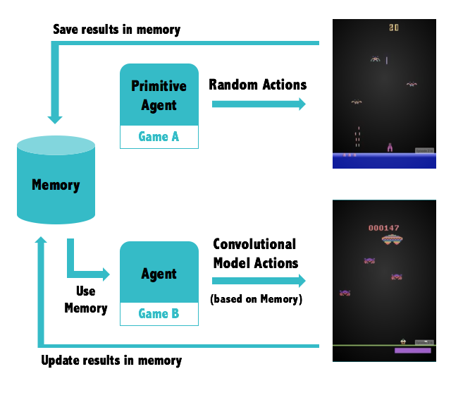

# Final Project (MSc Data Science) 

This project is based on AI memory abstraction using deep reinforcement learning.

---------- 

### Goal:

The main goal is to teach a software agent (AI) to play an Atari game, and then, use this information to play a different game, using previous experience instead of learning the new game from scratch.

---------- 

### Code structure:

|  | Code                                           | Description 
|--| :-------------:                                | -------------
|🤖| [Agents](src/code/agents)                      | Software agents who play games
|🌲| [Binary tree](src/code/binary-tree)            | Defines how the brain works
|🕹️| [Brain](src/code/brain)                        | Runs convolutional model
|🗄️| [Memory](src/code/memory)                      | Stores and Manages memories
|🔧| [Pixel management](src/code/pixel-management)  | Transforms raw images into blurred gray pixel inputs, easy to process
|📦| [Core](src/code/core)                          | All the code with dependencies, ready to use

---------- 

### How it works:

The underneath logic is based on [Q-Learning algorithm](https://en.wikipedia.org/wiki/Q-learning), then a deep neural network is applied to get knowledge from the environment in form of pixels. Once this model is set, all the information is stored as a memory.

Finally, the agent play a different game, using the previous game experiences stored in memory as initialization.



---------- 

```bash

Author: Alber Erre
University: City, University of London
Academic Year: 2017

```
